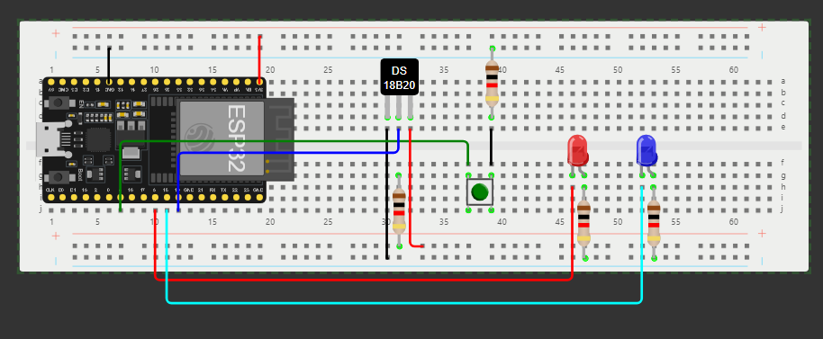

# IoT Temperature Monitor for ESP32

## Project Description

The IoT Temperature Monitor project is designed for the ESP32 platform. It reads temperature data from a DS18B20 sensor using the OneWire and DallasTemperature libraries and updates this reading periodically. On startup, the device checks for a saved WiFi configuration in SPIFFS (stored in a file such as "wifi.json"). If found, it connects to the specified network; otherwise, the ESP32 switches to Access Point (AP) mode (e.g., "ESP32_Config") to allow you to enter the credentials. 

## Circuit Diagram

Component Connections:
- DS18B20 Temperature Sensor: GPIO 19
- Reset Button: GPIO 4
- Red LED: GPIO 5
- Blue LED: GPIO 18

The project also features:
- **Real-time Data Updates:** A web server powered by ESPAsyncWebServer provides a client-side interface where temperature readings are pushed over a WebSocket connection.
- **Reset Functionality:** A hardware reset button clears the WiFi configuration (if held for 10 seconds) and restarts the device.
- **Modular Design:** Separate modules manage WiFi, sensor data acquisition, web server handling, and reset functionality, making the code easier to maintain and extend.
- **Client-side Interface:** The static files (HTML, JavaScript, CSS) are stored in a dedicated `data` folder and styled with Tailwind CSS, providing a modern and responsive UI.

## Project Structure

- **platformio.ini**: Contains build settings and library dependencies.
- **src/main.cpp**: The main entry point, initializing all modules.
- **lib/**: Contains modular components such as WiFiManager, SensorManager, WebServerManager, and ResetManager.
- **data/**: Holds the static client-side files (e.g., index.html, main.js) which are uploaded to SPIFFS.
- **Documentation & Examples**: Other documentation files and examples can be found throughout the repository.

## CLI Commands

Use the following commands to build, upload the firmware and SPIFFS files, and monitor the device output:

`pio run -t upload; pio run -t uploadfs; pio device monitor`

## User Manual

This section provides a quick guide on setting up and operating the device.

### Setup Instructions

1. **Hardware Connections:**
   - Connect the DS18B20 sensor to the ESP32 with a suitable pull-up resistor.
   - Ensure the reset button is properly wired (consider debounce and correct pin configuration).

2. **WiFi Configuration:**
   - On startup, the device checks SPIFFS for a "wifi.json" file.
   - If found, it connects to the saved network credentials.
   - If not, it starts in AP mode where you can enter your WiFi details.

3. **Uploading the Firmware and Files:**
   - Upload the firmware: `pio run -t upload`
   - Upload the SPIFFS files (containing your web assets): `pio run -t uploadfs`
   - Open the serial monitor with: `pio device monitor`

### Operating the Device

- **Accessing the Web Interface:**
  - Once connected to WiFi, the device will obtain an IP address.
  - Open your preferred browser and navigate to that IP to view the dashboard with real-time temperature updates.
  
- **Reset Functionality:**
  - To clear the saved WiFi settings (for example, when switching networks), press and hold the reset button for 10 seconds. The device will delete the configuration file from SPIFFS and restart.

### Troubleshooting

- **Temperature Readings:**
  - If readings are inconsistent or not detected, double-check sensor connections and the pull-up resistor value.
- **WiFi Issues:**
  - Verify that the "wifi.json" file is properly formatted and present in SPIFFS.
- **Web Dashboard:**
  - If the web interface is not loading correctly, check the serial monitor for error messages related to ESPAsyncWebServer initialization.
